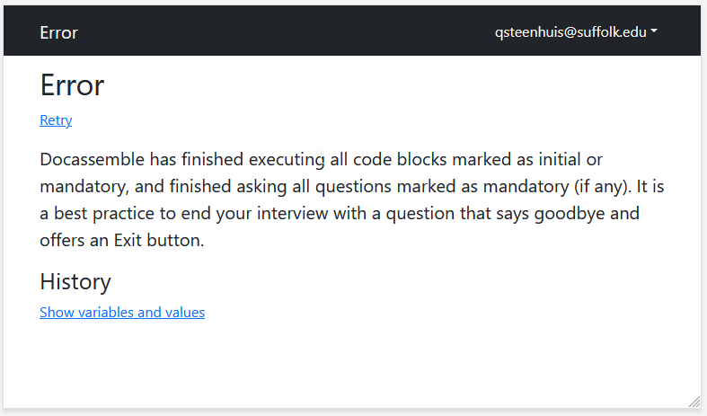
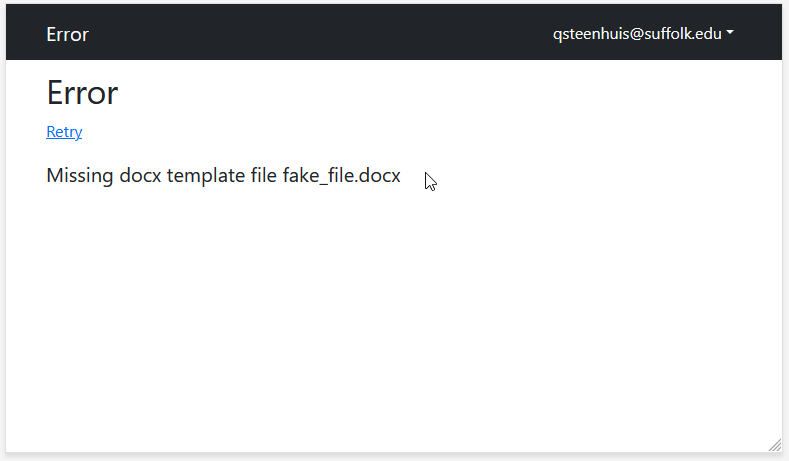
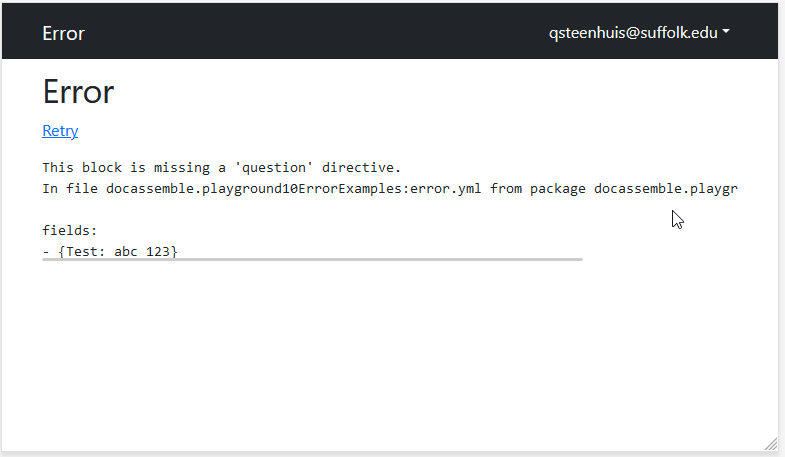
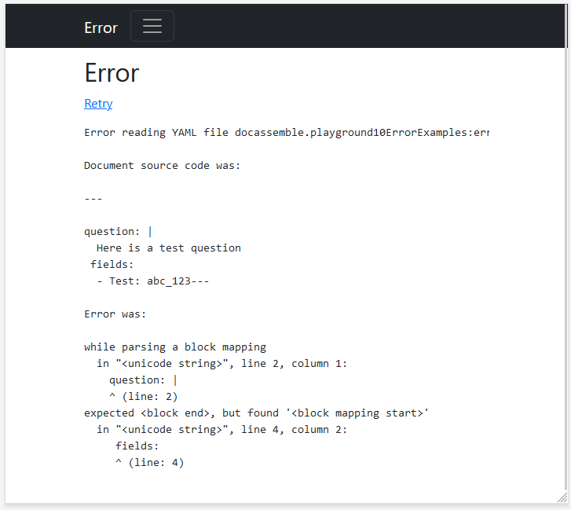
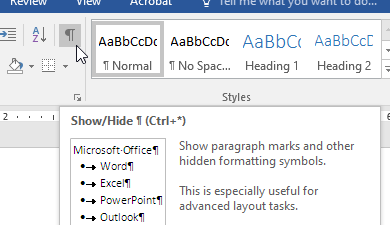

## Basic approach to troubleshooting

In computer programming, errors are inevitable. They can also be extremely helpful.
Error messages can be a guide to writing correct code.

:::info Errors can't hurt you 
In engineering, errors even in the construction
process can lead to catastrophes. In software development, you can restart your
computer, load an old copy of the code, or just try something new. 
Don't let errors scare you!
:::

Take this basic approach to solving problems while developing in Docassemble:

1. Read the error message
1. Identify whether the problem is with:
    - The interview YAML file format
    - Docassemble logic in your interview
    - Python code
    - A template file
1. Isolate the problem to a small section of your project
1. Try making a change to see if the error goes away

## Read the error message

Slow down and read the error message. Look for key words that might tell you what has gone wrong.

If you don't see a key word in the error that you can understand, read the error screen to see if you can identify which block in the YAML file Docassemble was trying to run. Then search for that block in the YAML file (copy and paste a snippet of the exact text you want to match) and look to see if you can catch a typo.

Some errors will be easier to read than others. Take a look and see if you can spot the error
on the screens below.



In the error message above, Docassemble tells us that there is no "initial or mandatory" block or question.
You may have seen this screen when you wrote your first interview from scratch.



In the error message above, we can see that Docassemble is not able to locate the template file named
`fake_file.docx`.

## Docassemble usage errors



In the error above, the Docassemble author has forgotten to include a `question` "directive" in a block that Docassemble thinks is intended to be a question block. (The word "directive" has a lot of synonyms in Docassemble--sometimes it is called a "specifier" or a "key").

Even if we didn't know what a "directive" is, below the error message, the entire block that Docassemble tried to run is reproduced. We can see that this block has a "fields" statement but nothing else. The more you practice working in Docassemble, the more errors like this will stick out.

## YAML syntax errors

Sometimes, you don't get an error message from Docassemble at all. Instead, you get an error message that indicates that Docassemble wasn't able to read the YAML file. A lot of subtle syntax errors can make the YAML file invalid.


<details>
<summary>
  Screen-reader friendly error
</summary>
<p>

```
Error reading YAML file docassemble.playground10ErrorExamples:error.yml

Document source code was:

---

question: |
  Here is a test question
 fields:
  - Test: abc_123---

Error was:

while parsing a block mapping
  in "<unicode string>", line 2, column 1:
    question: |
    ^ (line: 2)
expected <block end>, but found '<block mapping start>'
  in "<unicode string>", line 4, column 2:
     fields:
     ^ (line: 4)
```

</p>
</details>



The error message above indicates a problem with the YAML file itself. We know
because the first error message says "Error reading YAML file."

Helpfully, this error message also tells us exactly what line is a problem.
**Note: the error line numbers always refer to the line inside a block, not
relative to the whole file.** Remember that a block starts or ends with `---` at
the beginning of the line.

The error in this file is on both lines 2 and 4. The up caret `^` symbol tells
us exactly where on the line the YAML file appears to be invalid. In this case,
there's an extra space before the keyword `fields`. Removing the space will make
this valid YAML.

Error messages with YAML files can include:

- Using the wrong indentation
- Having a duplicate "key" (what Docassemble sometimes calls a specifier or
  directive -- the word before a `:`)
- Using an ambiguous symbol, like a `:` in a place that the YAML parser doesn't
  expect

When you run into an error message that you haven't seen before, first figure
out where Docassemble tells you the error is located. Look to see if anything
seems out of place on that line. If that doesn't help you spot an error, try
looking a line or two above or below.

### Try a YAML validator

The error messages you get from Docassemble can be very generic. You might find
it helpful to find a website that lets you validate a YAML file. Just copy and
paste the full YAML document into the online validator. Make sure that the YAML
validator you try understands multi-part YAML documents (ones with `---` in
them). Many don't.

[JSON Formatter.org's YAML Validator](https://jsonformatter.org/yaml-validator)
is one that works well.

## Use comments to reduce the problem scope

One of the most widely applicable troubleshooting techniques you can take is
to reduce the size of the problem. If the full text of the error message doesn't 
tell you where the problem is, try temporarily commenting out or deleting text
to make it easier to spot the code that is causing a problem.


### Partition the problem by halves for quick locating

Start by deleting or commenting out half of the document at once. Once you figure
out which half has the problem, divide the document in half again until you zero
in on a particular line.

### Comments in Mako

In your YAML file, you can put a comment in-line with the `#` symbol, like
this:

```yaml
# question: |
#  This question is commented out
---
question: |
  This question can still be referenced
```

But YAML comments can sometimes cause problems in the middle of a block.
Be ready to temporarily delete lines instead for fast troubleshooting. Make
sure you keep a copy of the lines that you delete!

### Comments in DOCX files

In a DOCX template file, you can try adding Jinja2 comments. Jinja2 comments
start with `{#` and end with  `#}`. They can span across multiple lines. Like this:

```jinja2
This document is for {{ users[0] }}. This section will still display.

{#
But this paragraph inside the comments won't get evaluated. Even if it has Jinja2 statements, like

Conditional paragraph

#}

While this un-commented section will still be evaluated.
```

Use the "divide in half" approach to zero in on the section of the document that
has a mistake.

Sometimes, Jinja2 comments can run into parsing problems, and instead of commenting
out a section you should consider temporarily deleting it. But comments will often
work.

## Troubleshooting DOCX templates

DOCX templates can cause a lot of challenges for troubleshooting. Here are a few tips:

### Problems with syntax

1. Try adding a highlight to the Jinja2 keywords and variables.
1. Count your Jinja2 directives to make sure opening and closing directives match:
    - Search for `{% if` and make sure the number of results matches `{% endif`
    - Search for `{%p if` and make sure it matches `{%p endif`
    - Search for matching `{{` and `}}`
1. Turn on "show paragraph marks"  and make sure that
   you don't have a `{%p` swallowing up what looks like a new paragraph but is really
   just a [soft return](https://word.tips.net/T000170_Understanding_Hard_and_Soft_Returns.html)    
1. Make sure there is a space between the `{{` and the variable name. Especially, if your variable starts with `r` or `p`: `{{r` or `{{p` mean something special to Jinja2

### Problems with corrupt DOCX templates or layout problems

Open the file in LibreOffice. However it renders in LibreOffice is how it will
renders when Docassemble converts it to a PDF. If you can fix it in Libreoffice,
it should still look right in Word.

Sometimes, corrupt DOCX files can be fixed by saving to RTF and then back to DOCX.