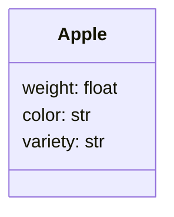
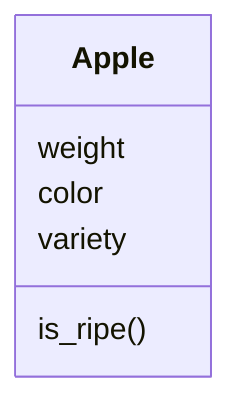
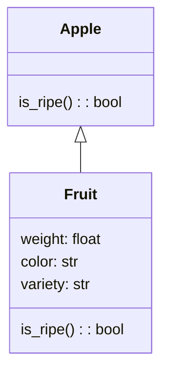

## Overview of Classes

Objects are a special type of variable. Instead of holding one piece of information, they can hold several at once. For example, the variable `x` can easily represent the number `10`. But what if you wanted a variable to refer to, for example, an apple? You might want to store several pieces of information about the apple at once. Perhaps you want to know its weight, color, and variety.

You could store the information in several variables, like this:

* `apple_weight`
* `apple_color`
* `apple_variety`

Suppose you need to keep track of 10 different apples. Now you have:

* `apple2_weight`
* `apple2_color`
* `apple2_variety`
... and so on

This can quickly become hard to manage. What's more, each time you make a new variable to represent an apple, you introduce the risk of making a mistake.

In object-oriented programming, you can more easily keep track of your variables by writing a kind of blueprint, or `class definition` that lets you group the related variables together. Once it's part of an object like, this, we call the individual variables `attributes`. An `object` is an `instance` of a `Class` with one or more of those attributes filled-in with specific values. 

Here is a diagram that represents the `Apple` class:



We list the _type_ of each variable after its name in this diagram. There's no reason that an object could not itself be composed of different objects.

### Class methods

Something special about `objects` is that you can also group `methods` with the object definition. A `method` is a function that is part of a class definition. Methods are used to describe dynamic aspects of an object; to compose various attributes; or to act on data in relation to the attributes of the object. For example, an apple might have a method `is_ripe()` that uses the `planted_date` and today's date to tell you if the apple is ready to be picked.

Here's the updated diagram that shows the `is_ripe()` method:



### Inheritance

A useful aspect of classes is that one class can rely on, or inherit, the definition of a different class. We call the more generic class the `parent` and the more specific class the `child` or `sub-class`. Below, the `Apple` class inherits from the more generic `fruit` class. It has its own `is_ripe()` method, because different kinds of fruit ripen at different times. But it can use all of the same attributes as the original Fruit class.



One benefit of inheritance is reducing the code you need to write. But inheritance also allows you to write your own very specific class, such as `Macoun` or `Cortland`, without having to update any functions in your program that might expect to work on every kind of `Apple` or even `Fruit`.

### Object conventions and syntax

Class names in Python almost always begin with a capital letter. If they are composed of multiple words, each word is capitalized, and there are no spaces or underscores. (this style is called CamelCase). When you create an object that is an instance of a class, you should use normal Pythonic style of lower case names with _ separating each word. This is not enforced, but helps someone else who reads your code.

You can interact with an object's attributes by using `.` `dot notation`. This simply means the name of the attribute comes after the object's name, separated by a `.`. For example: `my_apple.weight = 100.7`.

Methods also use dot notation. Like functions, you call a method with two parentheses after the method's name: `apple.is_ripe()`, optionally with one or more parameters. `apple.nutritional_value("human")`.

### Special class constructor methods `__init__()` and `init()`

Python Classes expect to see a special method, named `__init__`. This is called the class constructor. Docassemble objects should never replace this method. Instead, you will use the method `init()`

### Special method `__str__()`

Objects have a special built-in method that they expect to see, named `__str__`. The `__str__` method will return a string (text) representation of the object. This is very useful for use inside Docassemble, as we often display information on the screen. For example, the standard string representation of a person is: person.name.first + person.name.middle + person.name. Using the `__str__` method allows you to just mention the person object without having to write out first name, last name, etc.

```markdown
${user}
```

Would print out `Quinten Steenhuis` if `user.name.first` is Quinten and `user.name.last` is Steenhuis.

## Classes in Docassemble

OK. So far, we learned that an object is a type of variable that can store different, related information in one place. You may not create your own classes for some time. However, this background is helpful for making use of Docassemble's built-in helper classes, methods, and functions that expect to work on a built-in class.

### How Docassemble classes differ

In order to work with Docassemble, every object should inherit from the `DAObject` class.

You may have seen that in most class definitions, you typically list all of the attributes when you create the class. In Docassemble, missing variable definitions are needed to trigger a question being asked. So, instead, you will normally leave those attributes undefined at the class definition time. You can include a comment that lists all of the attributes, and also make use of those attributes inside methods.

Docassemble objects also expect to know their own name, stored as a special attribute `instanceName`. It is very easy to get confused with this aspect of Docassemble. However: when you stick with the most common uses of classes, you won't really have to think about this.

### Using an object inside Docassemble

#### The `modules` block

If you write your own `Class`, you need to tell Docassemble that you plan to use it with a modules block:

```yaml
---
modules:
  - module_from_other_package
  - .module_in_this_package
```

#### The `objects` block

You create an `instance` of an object and assign its name with the `objects` block:

```yaml
---
objects:
  - user: Individual
```

Optionally, you can use the special method `.using()` to pass arguments to the class constructor. This is an advanced topic.

#### Working with the object as a variable

Treat object `attributes` just like ordinary variables. For example:

```yaml
---
question: |
  Your birthday
fields:
  - Enter date: user.birthdate
    datatype: date
```

Be careful when treating the `object` itself as a variable. For example:

```python
user = other_user
```

Is valid Python. It creates a new _variable_ named `user` that points to the existing object, `other_user`. But this can cause trouble, because Docassemble objects keep track of their own name as an attribute. When Docassemble is searching for a question that defines the value of `user`, instead it will try to find a question that defines the value of `other_user`.

### Docassemble's built-in objects

Docassemble has a large number of [built-in Classes](https://docassemble.org/docs/objects.html#stdclasses), as well as optional Classes designed to [simplify legal matters](https://docassemble.org/docs/legal.html#tocAnchor-1-2). Many of these are utility classes that help write an interview in a more abstract way, but don't represent real-world objects.

You will most likely use these few classes representing things in the physical world again and again:

* [`Person`](https://docassemble.org/docs/objects.html#Person), representing a legal Person that does not need to be an individual (e.g., it could be a corporation)
* [`Individual`](https://docassemble.org/docs/objects.html#Individual), representing an individual person
* [`Name`](https://docassemble.org/docs/objects.html#Name) and [`IndividualName`](https://docassemble.org/docs/,objects.html#IndividualName), representing a name
* [`Address`](https://docassemble.org/docs/objects.html#Address), representing an address in the real-world, together with its different components (street, longitude/latitude, etc).

They are used throughout Docassemble. Several built-in functions also expect these objects as parameters.

The third party Income class is also useful for working with financial information:

* [`Income`](https://github.com/GBLS/docassemble-income)

It has several advantages over the Docassemble built-in Classes to represent income information.

You may define your own objects as [`DAObject`](https://docassemble.org/docs/objects.html#DAObject)s and benefit from the neater method of organizing related attributes in one variable, without needing to write your own class definition. 

You will also often work with the [`DAList`](https://docassemble.org/docs/groups.html#gather%20list) and [`DADict`](https://docassemble.org/docs/groups.html#gather%20dictionary) objects, which allow you to gather repeated information.

## Assignment

The purpose of this assignment is to get you comfortable using Docassemble objects inside your own code. You will write much more _idiomatic_ and neatly written code when you use these patterns. You don't necessarily need to understand the full theory of object-oriented programming to do this, but a little background helps.

### Describe a Python class for a law school class

Think of a generic class offering in a law school setting, and how you would describe it in computer code that might be used
to create a course catalog and to help students decide to sign up for it.

1. What attributes would your class have? Consider aspects such as course title, location, etc.
1. What methods would be appropriate to include?
1. What would the class's `str` method look like? (Using pseudocode is fine)

Write out a class definition. You do not need to use Python syntax. You can use a formal UML specification, or just a Word document that lists the class name, lists the attributes, and lists the methods of the class under separate headings. Explain why you have chosen the attributes and methods you included.

#### Stretch goal:

Try creating a UML diagram for your class like the ones in the Object Oriented Programming section of this documentation. You might use [Draw.io](https://www.draw.io/), [Creately](https://creately.com/), or [Mermaid.js](https://mermaid-js.github.io/mermaid-live-editor/).

Here's a Mermaid.js diagram for the Apple class we discussed earlier:

```
classDiagram
class Apple {
  is_ripe(): bool
}

Apple <|-- Fruit

class Fruit {
  weight: float
  color: str
  variety: str
  is_ripe(): bool  
}
```

### Alter the interview below so that it leverages Docassemble built-in classes and methods

Make use of the:

* `Individual` class: https://docassemble.org/docs/objects.html#Individual
* `Address` class: https://docassemble.org/docs/objects.html#Address

Remember that an `Individual` object has a built-in method to display a text representation of itself.

Turn on the [address autocompletion](https://docassemble.org/docs/fields.html#address%20autocomplete) feature.

```yaml
---
mandatory: True
code: |
  welcome
  user_name_first
  user_address_street
  display_results
---
question: |
  Welcome to the interview
field: welcome
---
question: |
  Your name
fields:
  - First name: user_name_first
  - Last name: user_name_last
---
question: |
  When were you born?
fields:
  - no label: user_birthdate
---
question: |
  Your address
fields:
  - Street address: user_address_street
  - Unit: user_address_unit
  - City: user_address_city
  - State: user_address_state
  - Zip: user_address_zip
---
comment: |
  A template is a reusable block of Markdown+Mako text. This template will be used in both a question and a document you can download.
template: results
content: |
  # Results

  Hello, ${user_name_first} ${user_name_last}.

  You live at:

  ${user_address_street}

  ${user_address_city}, ${user_address_state} ${user_address_zip}

  You are ${year_of(today()) - year_of(user_birthdate)} years old today.
---
event: display_results
question: |
  Results
subquestion: |
  ${results}
attachments:
  - Name: Your results
    content: |
      ${results}
```

## Turn in your work

Use Blackboard to turn in your work. You will need a link to your working interview, the actual YAML code, and your class definition either as a Word File, a UML diagram, or simply written out.

